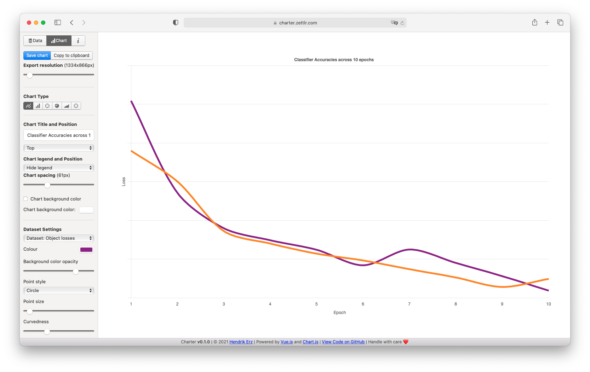
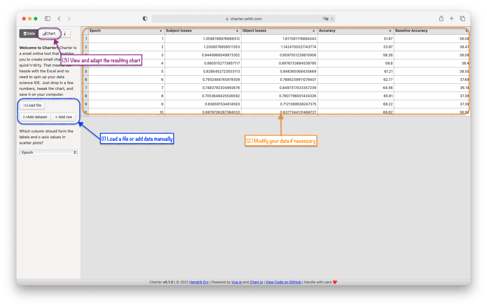

# Charter

> Charter is a lightweight tool that lets you create small charts at lightning speed.

Everyone who has at least once in their life dealt with numbers, and needed to present them, has had this problem: How do I quickly create a simple chart that just puts these numbers into perspective? Most of us will fall back to Microsoft Excel, but it's hard to "just throw in some numbers," as Excel has quite the attitude towards data. Especially the data scientists among you may have had the thought cross their mind that spinning up RStudio or creating a Jupyter Notebook just for the sake of visualising a handful of data is overkill. And when you look for charting tools online, you may quickly realise that this market is aimed at the secluded business levels of companies where overpaid CEOs are happy to throw in some bucks for their teams to make the occasional graph.

Enter Charter: Charter gives you the tool in between overkills and underdogs that remains reasonable. It's extremely lightweight and limited -- just what you need for that one line or bar chart. You won't be able to use it for sophisticated data visualisations, but if you need those, you'll be better off with professional tools anyway, such as matplotlib or RStudio's charting libraries.

## Getting Started

To get started with Charter, simply visit the public setup at [charter.zettlr.com](https://charter.zettlr.com/) and begin working. If you prefer, you can set up the app for yourself by following the steps in the development guide below.

The workflow with Charter is simple:

1. Load a TSV/CSV file or enter your data manually in the data viewer.
2. Modify the chart's appearance in the chart view.
3. Export as PNG or copy the chart to your clipboard.

And the best is: Because it fulfills exactly one purpose there is no winning in taking money for it. It's free and Open Source. It's basically your computer's built-in calculator -- only for charts.

## Development

As this is just a regular TypeScript app, you can follow the standard workflow. This means, have NodeJS and optionally yarn installed, then run:

1. `git clone`
2. `yarn install` or `npm install`
3. To build, run `yarn build:web` or `npm run build:web`
4. If you want to test it out locally, run `yarn start` or `npm run start`. This will spin up a development server with HMR enabled.

## License

This software and all of its accompanying source code is licensed via the GNU GPL 3.0 license. You can view the full text of the license in the [LICENSE](./LICENSE) file.
